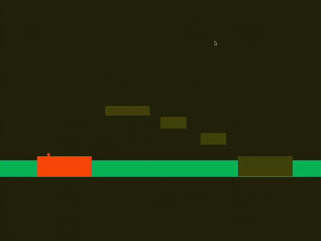

# Dash-Ball
Dash-ball? Yeah, exactly that or something, a Unity game of some sort.
I didn't set out to make it, it just happened while I was testing some
things...

## Demo

## Controls

Jump - X

Move - Left Arrow, Right Arrow

Dash - Direction + X 

        e.g Left + X - dash left

            Right + Up - dash up towards right diagonally

Restart Level - Backspace

Dash and Jump reset when you land on a block.

[Play the game](https://emelent.itch.io/dashball)
